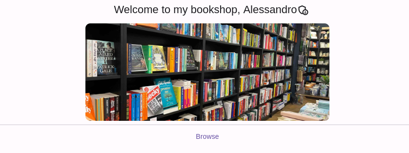

# bookshop_fe

Online bookshop frontend written in Flutter.



## Configuration

Create a `.env` file in the `assets/` folder with the following content:

```ini
CLIENT_ID=bookshop
KEYCLOAK_URI_SCHEME=http
KEYCLOAK_REALM=unimi
KEYCLOAK_HOST=localhost:8080
```

## Run

### Start the backend

Clone the [bookshop-BE](https://github.com/alex27riva/bookshop-BE) repo and start it.

I suggest using [Pycharm](https://www.jetbrains.com/pycharm/) for Venv and Packages installation.

### Start the frontend

```bash
flutter run -d chrome --web-renderer html --web-port=8000
```

